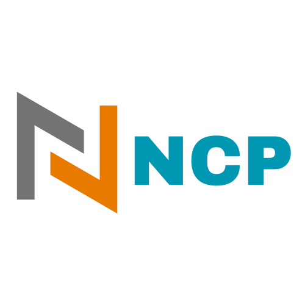
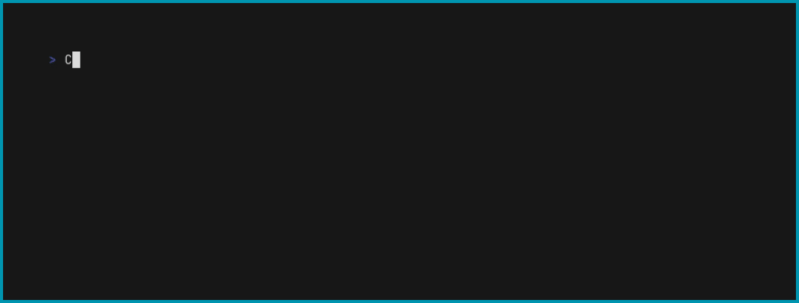

<h2 align="center">
  <p align="center"></p>
</h2>
<p align="center">
  
   <a href="https://github.com/kha7iq/ncp/releases">
   
   <a href="https://goreportcard.com/report/github.com/kha7iq/ncp">
   
   <a href="#">
   <a href="https://github.com/kha7iq/ncp/issues">
   
   <a href="https://github.com/kha7iq/ncp/blob/master/LICENSE">
   
</p>

<p align="center">
  <a href="https://ncp.lmno.pk">Documentation</a> •
  <a href="#installation">Installation</a> •
  <a href="#features">Features</a> •
  <a href="#usage">Usage</a> •
  <a href="#contributing">Contributing</a> •
</p>

# NCP (NFS Copy)

NCP is a file transfer utility that enables efficient copying of files to and from an NFS server. It offers a convenient way to transfer files between your local machine and an NFS server, supporting both upload and download operations.

:loudspeaker: *Note ncp only supports NFSv3*

## Features

- Easy file transfer to and from an NFS server
- Support for upload and download operations
- Multi-architecture binaries available for installation (e.g deb, apk, rpm, exe)
- Compatible with Windows and macOS operating systems
- Option to specify UID and GID for write operations using a global flag
- Display upload and download speeds in real-time.
- Show the elapsed time for write operations.
- Show total file size




## Installation


<details>
    <summary>Linux</summary>

```bash
# DEB
export NCP_VERSION="0.1.1"
wget -q https://github.com/kha7iq/ncp/releases/download/v${NCP_VERSION}/ncp_amd64.deb
sudo dpkg -i ncp_amd64.deb
# RPM
sudo rpm -i ncp_amd64.rpm
```
- AUR
```bash
yay -S ncp-bin

pamac install ncp-bin
```

</details>

<details>
    <summary>Windows</summary>

```bash
scoop bucket add ncp https://github.com/kha7iq/scoop-bucket.git
scoop install ncp
```
</details>

<details>
    <summary>Bash Install Script</summary>


By default, ncp is going to be installed at `/usr/bin/`. Sudo privileges are required for this operation.

If you would like to provide a custom install path, you can do so as an input to the script. 
For example, you can run `./install.sh $HOME/bin` to install ncp in the specified directory.

```bash
curl -s https://raw.githubusercontent.com/kha7iq/ncp/master/install.sh | sudo sh
```
or
```bash
curl -sL https://bit.ly/installncp | sudo sh
```

</details>

<details>
    <summary>MacOS</summary>

```bash
brew install kha7iq/tap/ncp
```
</details>

<details>
    <summary>Manual</summary>

```bash
# Chose desired version
export NCP_VERSION="0.1.1"
wget -q https://github.com/kha7iq/ncp/releases/download/v${NCP_VERSION}/ncp_linux_amd64.tar.gz && \
tar -xf ncp_linux_amd64.tar.gz && \
chmod +x ncp && \
sudo mv ncp /usr/local/bin/.
```
</details>

Alternatively you can head over to [release pages](https://github.com/kha7iq/ncp/releases)
and download binaries for all supported platforms.

## Docker

Docker container is also available on both dockerhub and github container registry.

`latest` tag will always pull the latest version available.
<details>
    <summary>Docker</summary>

```bash
docker pull khaliq/ncp:latest
```
```bash
docker pull ghcr.io/kha7iq/ncp:latest
```

- Run

```bash
docker run khaliq/ncp:latest
```
</details>

## Usage

### Copying Files/Folders to NFS Server

To copy the `_local/src` folder to the NFS server with the IP address `192.168.0.80` and the NFS path `data`, use the following command:
```bash
ncp to --host 192.168.0.80 --nfspath data --input /src/backup.tar.gz
```
See [Usage Documentation](https://ncp.lmno.pk/02-usage/) for more details

## Contributing

Contributions, issues and feature requests are welcome!<br/>Feel free to check
[issues page](https://github.com/kha7iq/ncp/issues). You can also take a look
at the [contributing guide](https://github.com/kha7iq/ncp/blob/master/CONTRIBUTING.md).

## Issues

If you encounter any problems or have suggestions for improvements, please [open an issue](https://github.com/username/repo/issues) on GitHub.


### License

NCP is licensed under the MIT License. Please note that it may use third-party libraries that have their own separate licenses. Refer to the individual licenses of those libraries for more information.