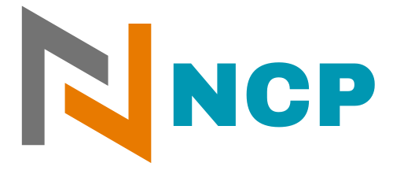

<h2 align="center">
  

     
</h2>

# NCP (NFS Copy)

NCP is a file transfer utility that enables efficient copying of files to and from an NFS server. It offers a convenient way to transfer files between your local machine and an NFS server, supporting both upload and download operations.

*Note ncp only supports NFSv3*
## Features

- Easy file transfer to and from an NFS server
- Support for upload and download operations
- Multi-architecture binaries available for installation (e.g. deb, apk, rpm)
- Compatible with Windows and macOS operating systems
- Option to specify UID and GID for write operations using a global flag
- Display upload and download speeds in real-time.
- Show the elapsed time for write operations.
- Show total file size

## Contributing

Contributions, issues and feature requests are welcome! Feel free to check
[issues page](https://github.com/kha7iq/ncp/issues). You can also take a look
at the [contributing guide](https://github.com/kha7iq/ncp/blob/master/CONTRIBUTING.md).

## Issues

If you encounter any problems or have suggestions for improvements, please [open an issue](https://github.com/username/repo/issues) on GitHub.

## License

NCP is licensed under the MIT License. Please note that it may use third-party libraries that have their own separate licenses. Refer to the individual licenses of those libraries for more information.